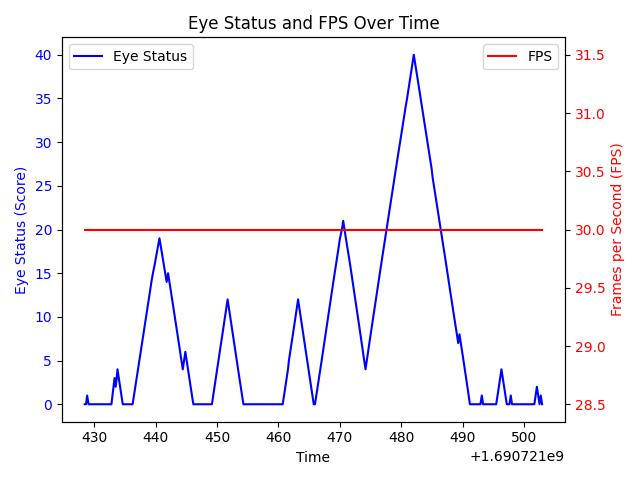

# Drowsiness Detection System

## Introduction

This is a Deep Learning based command line application project which detects the drowsiness of the person and alerts him/her if he/she is drowsy, classifying the status of the eyes into two classes, open or closed. Following are the steps involved:
- Live video is captured from the camera

- The system creates a region of interest (ROI) around the eyes of the person.

- It then passes the ROI to a Convolutional Neural Network (CNN) which classifies the status of the eyes into open or closed.

- If the eyes are closed, the system checks for how long they have been closed.

- If they have been closed for a certain amount of time, the system alerts the person by a beep sound until he/she open eyes.


## Project Prerequisites

The requirement for this Python project is a webcam through which we will capture images. You need to have Python (3.6 and above version recommended) installed on your system, then using pip, you can install the necessary packages.

- activate the virtual environment
```venv\Scripts\activate```

- install the required packages
```pip install -r requirements.txt```

- run the project
```python drowsiness_detection.py```

The “haar cascade files” folder contains the xml files required to see the object from the drawing. For us, we look for the person’s face and eyes.
In the models folder we have the model file “cnnCat2.h5” which was trained on convolutional neural networks.
We have an audio clip called “alarm.wav” that plays when the person feels asleep.
The “Model.py” file contains the program by which we trained our data set and created our classification model. In this file you could see the implementation of convolutional neural network.
“Drowsiness detection.py” is the main file we use for our project. To start the detection process, we need to create this file.

Let’s now understand how our algorithm works step by step.

#### Step 1 – Take Image as Input from a Camera

With a webcam, we will take images as input. So to access the webcam, we made an infinite loop that will capture each frame. We use the method provided by OpenCV, cv2.VideoCapture(0) to access the camera and set the capture object (cap). cap.read() will read each frame and we store the image in a frame variable.

#### Step 2 – Detect Face in the Image and Create a Region of Interest (ROI)

To detect the face in the image, we need to first convert the image into grayscale as the OpenCV algorithm for object detection takes gray images in the input. We don’t need color information to detect the objects. We will be using haar cascade classifier to detect faces. This line is used to set our classifier face = cv2.CascadeClassifier(‘ path to our haar cascade xml file’). Then we perform the detection using faces = face.detectMultiScale(gray). It returns an array of detections with x,y coordinates, and height, the width of the boundary box of the object. Now we can iterate over the faces and draw boundary boxes for each face.
for (x,y,w,h) in faces:

```cv2.rectangle(frame, (x,y), (x+w, y+h(100, 100,100), 1 )```

#### Step 3 – Detect the eyes from ROI and feed it to the classifier

The same procedure to detect faces is used to detect eyes. First, we set the cascade classifier for eyes in leye and reye respectively then detect the eyes using left_eye = leye.detectMultiScale(gray). Now we need to extract only the eyes data from the full image. This can be achieved by extracting the boundary box of the eye and then we can pull out the eye image from the frame with this code.

```l_eye = frame[ y : y+h, x : x+w ]```

l_eye only contains the image data of the eye. This will be fed into our CNN classifier which will predict if eyes are open or closed. Similarly, we will be extracting the right eye into r_eye.

#### Step 4 – Classifier will Categorize whether Eyes are Open or Closed

We are using CNN classifier for predicting the eye status. To feed our image into the model, we need to perform certain operations because the model needs the correct dimensions to start with. First, we convert the color image into grayscale using r_eye = cv2.cvtColor(r_eye, cv2.COLOR_BGR2GRAY). Then, we resize the image to 24*24 pixels as our model was trained on 24*24 pixel images cv2.resize(r_eye, (24,24)). We normalize our data for better convergence r_eye = r_eye/255 (All values will be between 0-1). Expand the dimensions to feed into our classifier. We loaded our model using model = load_model(‘models/cnnCat2.h5’) . Now we predict each eye with our model
lpred = model.predict_classes(l_eye). If the value of lpred[0] = 1, it states that eyes are open, if value of lpred[0] = 0 then, it states that eyes are closed.

#### Step 5 – Calculate Score to Check whether Person is Drowsy

The score is basically a value we will use to determine how long the person has closed his eyes. So if both eyes are closed, we will keep on increasing score and when eyes are open, we decrease the score. We are drawing the result on the screen using cv2.putText() function which will display real time status of the person.

### Drowsiness Detection Execution

Let’s execute drive drowsiness detection system and see the working of our ml project. To start the project, you need to open a command prompt, go to the directory where our main file “drowsiness detection.py” exists. Run the script with this command.

```python “drowsiness detection.py”```

It may take a few seconds to open the webcam and start detection.

## Test Case photos
#### Camera view


#### Graph view


## Use Cases
#### 1. Drivers

Drowsiness detection system can be used by drivers to avoid accidents caused due to drowsiness. It can be used by drivers of cars, trucks, and other vehicles. It can also be used by pilots in aircraft. This can save many lives and can be used as a safety measure especially in long journeys and highways.

#### 2. Students

Students can use this system to prevent drowsiness during their study hours and can be more attentive while studying. It also helps a lot in online classes and during online exams.

#### 3. Employees

Employees can use this system to prevent drowsiness during their work hours and can be more attentive while working. It can be used by employees who have to work for long hours and have to sit in front of computers.


### Summary

In this Python project, we have built a drowsiness alert system that you can implement in numerous ways. We used OpenCV to detect faces and eyes using a haar cascade classifier and then we used a CNN model to predict the status.